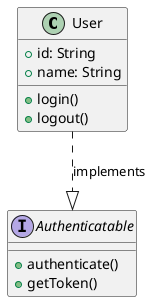
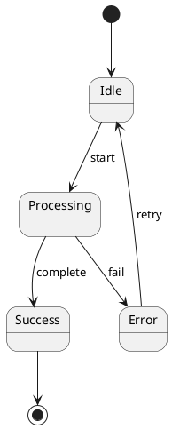
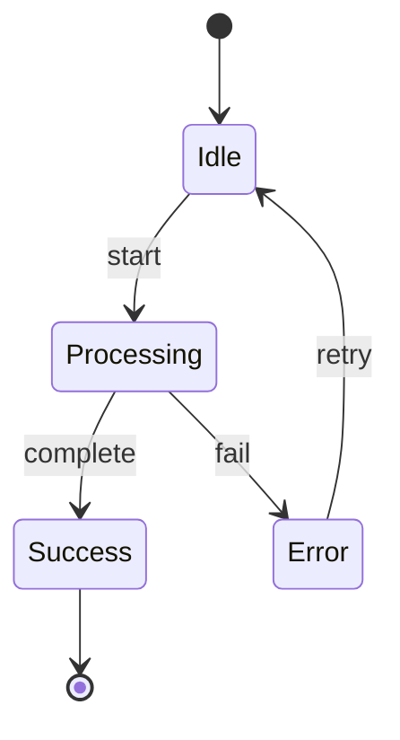

# convert2mermaid

[](https://www.npmjs.com/package/convert2mermaid)
[](https://opensource.org/licenses/MIT)

A powerful command-line tool that converts diagrams from multiple formats (Visio, DrawIO, Excalidraw, PlantUML) into [Mermaid](https://mermaid.js.org/) syntax. Perfect for maintaining documentation in version control, generating diagrams for markdown files, and converting legacy diagrams to modern formats.

## 🚀 Features

-   **Universal Format Support**: Convert from Visio, DrawIO, Excalidraw, and PlantUML
-   **Smart Detection**: Automatically identifies diagram types with confidence scoring
-   **Comprehensive Diagram Types**: Supports flowcharts, class diagrams, sequence diagrams, state diagrams, and more
-   **Preserves Styling**: Maintains colors, line styles, arrows, and shape types
-   **CLI Interface**: Easy-to-use command-line tool
-   **Well-Tested**: 54+ passing tests with full backwards compatibility

## 📦 Installation

```bash
# Clone the repository
git clone https://github.com/jgreywolf/convert2mermaid.git
cd convert2mermaid

# Install dependencies
npm install

# Build the project
npm run build
```

## 🎯 Quick Start

```bash
# Basic conversion
node ./dist/index.js -i input-diagram.drawio -o output.mmd

# Let it auto-detect output filename
node ./dist/index.js -i my-diagram.puml

# Specify output format (defaults to .mmd)
node ./dist/index.js -i diagram.vsdx -o result.md -f md
```

## 📖 Usage

### Command Line Options

```bash
node ./dist/index.js [options]

Required:
  -i, --inputFile <path>        Path to input diagram file

Optional:
  -o, --outputFile <path>       Output file path (defaults to input filename with .mmd extension)
  -f, --format <format>         Output format: 'mmd' or 'md' (defaults to 'mmd')
  -d, --diagramType <type>      Force specific diagram type (usually auto-detected)
```

## 🎨 Supported Formats

### 📐 Excalidraw (.excalidraw)

**Diagram Types:**

-   ✅ Flowcharts
-   ✅ Basic diagrams with shapes and connectors

**Features:**

-   Shape type recognition (rectangles, circles, diamonds, etc.)
-   Connector/arrow preservation
-   Text label extraction
-   Hand-drawn aesthetic intent preserved where possible

**Example:**

```bash
node ./dist/index.js -i sketch.excalidraw -o output.mmd
```

---

### 📊 DrawIO (.drawio)

**Diagram Types:**

-   ✅ **Flowcharts** - Process flows, decision trees
-   ✅ **Class Diagrams** - UML classes with attributes and methods
-   ✅ **Sequence Diagrams** - Lifelines, actors, messages, activations, frames (par/alt/loop/opt)
-   ✅ **State Diagrams** - States, transitions, initial/final states
-   ✅ **Component Diagrams** - Components, packages, dependencies
-   ✅ **Entity-Relationship Diagrams** - Entities, relationships, attributes
-   ✅ **Network Diagrams** - Network nodes, connections, infrastructure

**Features:**

-   **Swimlane aggregation** - Automatically combines class members within swimlanes
-   **Advanced shape mapping** - 50+ shape types supported
-   **Style preservation** - Colors, line styles, arrows, fills
-   **UML notation support** - Stereotypes (<<interface>>, <<abstract>>)
-   **HTML entity decoding** - Properly handles formatted content
-   **Activation boxes** - Sequence diagram activation regions
-   **Frame detection** - Recognizes par, alt, loop, opt constructs

**Supported Shapes:**

-   Basic: rectangles, circles, ellipses, diamonds, triangles, hexagons
-   Flowchart: process, decision, document, database, delay, display, manual input, stored data
-   UML: actors, lifelines, frames, notes
-   Specialized: cylinders, parallelograms, trapezoids, cloud, paper tape

**Examples:**

```bash
# Class diagram with swimlanes
node ./dist/index.js -i class-diagram.drawio -o classes.mmd

# Sequence diagram with actors and messages
node ./dist/index.js -i sequence.drawio -o sequence.mmd

# State diagram
node ./dist/index.js -i state-machine.drawio -o states.mmd
```

---

### 🌿 PlantUML (.puml, .plantuml)

**Diagram Types:**

-   ✅ **Class Diagrams** - Classes, interfaces, abstract classes, enumerations
-   ✅ **Component Diagrams** - Components, packages, databases
-   ✅ **State Diagrams** - States, transitions, initial/final states
-   ✅ **Use Case Diagrams** - Actors, use cases, includes/extends relationships
-   ✅ **Sequence Diagrams** - Participants, actors, messages, activations
-   ✅ **Activity Diagrams** - Activities, decisions, start/stop nodes
-   ✅ **Gantt Charts** - Tasks, milestones, durations (basic support)

**Features:**

-   **Full UML notation support**:
    -   Visibility modifiers: `+` (public), `-` (private), `#` (protected), `~` (package)
    -   Relationships: `--|>` (inheritance), `..|>` (implementation), `o--` (aggregation), `*--` (composition)
    -   Stereotypes: `<<interface>>`, `<<abstract>>`, `<<enumeration>>`
-   **Modular parser architecture** - Type-specific parsing for each diagram type
-   **Smart type detection** - Analyzes content and directives (@startuml, @startgantt)
-   **Comprehensive relationship handling** - Supports all UML relationship types with cardinality

**Class Diagram Output:**
Converts to Mermaid `classDiagram` syntax with proper UML notation

**Component Diagram Output:**
Converts to Mermaid `block-beta` syntax

**State Diagram Output:**
Converts to Mermaid `stateDiagram-v2` syntax

**Examples:**

```bash
# Class diagram with full UML notation
node ./dist/index.js -i class-model.puml -o classes.mmd

# Component architecture diagram
node ./dist/index.js -i architecture.puml -o components.mmd

# State machine
node ./dist/index.js -i state-machine.puml -o states.mmd

# Sequence diagram
node ./dist/index.js -i sequence.puml -o sequence.mmd

# Use case diagram
node ./dist/index.js -i use-cases.puml -o usecases.mmd
```

---

### 📁 Visio (.vsdx)

**Diagram Types:**

-   ✅ **Flowcharts** - Basic process flows
-   ✅ **Basic diagrams** - Shapes and connectors

**Features:**

-   Shape and connector conversion
-   Text label extraction
-   Basic styling preservation

**Example:**

```bash
node ./dist/index.js -i flowchart.vsdx -o output.mmd
```

## 🧠 Smart Detection Engine

The tool includes an intelligent diagram type detection system:

-   **Confidence Scoring** - Each detection includes a confidence percentage
-   **Multi-Pattern Analysis** - Examines shapes, relationships, and flow patterns
-   **Content-Aware Parsing** - Recognizes UML relationships, stereotypes, temporal sequences
-   **Automatic Format Detection** - Identifies diagram type from file content

**Detection Output Example:**

```
Detected diagram type: class (95% confidence)

Detection evidence:
  - class: Found @startuml directive, Found explicit class diagram directive (95%)

Diagram metadata: 40 shapes, 12 edges
```

## 📊 Output Formats

### Mermaid Syntax Generated

Depending on the detected diagram type, the tool generates appropriate Mermaid syntax:

-   **Class Diagrams** → `classDiagram`
-   **State Diagrams** → `stateDiagram-v2`
-   **Component Diagrams** → `block-beta`
-   **Sequence Diagrams** → `sequenceDiagram`
-   **Flowcharts** → `flowchart TD` / `flowchart LR`
-   **ER Diagrams** → `erDiagram`

### Output File Formats

-   `.mmd` - Pure Mermaid syntax
-   `.md` - Markdown with Mermaid code blocks

## 🔧 Advanced Usage

### Force Specific Diagram Type

```bash
node ./dist/index.js -i diagram.drawio -o output.mmd -d class
```

### Batch Conversion

```bash
# Convert all PlantUML files in a directory
for file in diagrams/*.puml; do
  node ./dist/index.js -i "$file" -o "output/$(basename "$file" .puml).mmd"
done
```

### Use in Scripts

```bash
#!/bin/bash
# Convert and commit diagrams
node ./dist/index.js -i architecture.drawio -o docs/architecture.mmd
git add docs/architecture.mmd
git commit -m "Update architecture diagram"
```

## 🧪 Testing

```bash
# Run all tests
npm test

# Run tests in watch mode
npm run test:watch

# Run specific test file
npm test -- src/parser/plantumlParser.spec.ts
```

## 🏗️ Architecture

The tool uses a modular architecture:

```
src/
├── index.ts                 # CLI entry point
├── parser/                  # Format-specific parsers
│   ├── drawioParser.ts      # DrawIO XML parser
│   ├── plantumlParser.ts    # PlantUML text parser
│   ├── excalidrawParser.ts  # Excalidraw JSON parser
│   └── visioParser.ts       # Visio VSDX parser
├── generators/              # Mermaid syntax generators
│   ├── classDiagramGenerator.ts
│   ├── stateDiagramGenerator.ts
│   ├── blockDiagramGenerator.ts
│   └── flowchartGenerator.ts
├── detection/               # Smart diagram type detection
│   ├── DrawIODetector.ts
│   ├── PlantUMLDetector.ts
│   └── DiagramDetector.ts
├── utils/                   # Utility functions
│   ├── labelUtils.ts
│   ├── classUtils.ts
│   ├── relationshipUtils.ts
│   └── styleUtils.ts
└── shapes/                  # Shape type mappings
    └── flowchartShapes.ts
```

## 📚 Examples

### Example 1: Class Diagram Conversion

**Input (PlantUML):**



**Output (Mermaid):**

```mermaid
classDiagram
  class User {
    +id: String
    +name: String
    +login()
    +logout()
  }
  class Authenticatable
  <<interface>> Authenticatable {
    +authenticate()
    +getToken()
  }
  User ..|> Authenticatable : implements
```

### Example 2: State Diagram Conversion

**Input (PlantUML):**



**Output (Mermaid):**



## 🐛 Known Limitations

1. **PlantUML Use Case Detection**: Global detector may identify use case diagrams as sequence diagrams (parser correctly processes them)
2. **Gantt Syntax**: Basic support; full PlantUML Gantt syntax (sections, dateFormat) needs enhancement
3. **Complex Nesting**: Very deeply nested structures may need manual adjustment
4. **Multi-Page Diagrams**: Currently processes single page/diagram per file

## 🚀 Future Enhancements

### High Priority

-   [ ] Full PlantUML Gantt syntax support
-   [ ] Multi-page diagram support
-   [ ] Enhanced use case detection

### Medium Priority

-   [ ] Lucidchart support
-   [ ] Composite states in state diagrams
-   [ ] Object diagrams
-   [ ] Deployment diagrams

### Low Priority

-   [ ] Gliffy support
-   [ ] Timing diagrams
-   [ ] Network diagram enhancements

## 🤝 Contributing

Contributions are welcome! Please feel free to submit a Pull Request.

1. Fork the repository
2. Create your feature branch (`git checkout -b feature/amazing-feature`)
3. Commit your changes (`git commit -m 'Add some amazing feature'`)
4. Push to the branch (`git push origin feature/amazing-feature`)
5. Open a Pull Request

## 📝 License

This project is licensed under the MIT License - see the LICENSE file for details.

## 👏 Acknowledgments

-   Built with [TypeScript](https://www.typescriptlang.org/)
-   Powered by [Mermaid.js](https://mermaid.js.org/)
-   Uses [vsdx-js](https://github.com/jgreywolf/vsdx-js) for Visio parsing
-   XML parsing with [xml2js](https://github.com/Leonidas-from-XIV/node-xml2js)
-   Testing with [Vitest](https://vitest.dev/)

## 📧 Contact

-   GitHub: [@jgreywolf](https://github.com/jgreywolf)
-   Issues: [GitHub Issues](https://github.com/jgreywolf/convert2mermaid/issues)

## 📊 Stats

-   **Formats Supported**: 4 (Visio, DrawIO, Excalidraw, PlantUML)
-   **Diagram Types**: 15+ types across all formats
-   **Shape Mappings**: 50+ shape types
-   **Test Coverage**: 54+ passing tests
-   **Dependencies**: Optimized to 144 packages (65% reduction)
